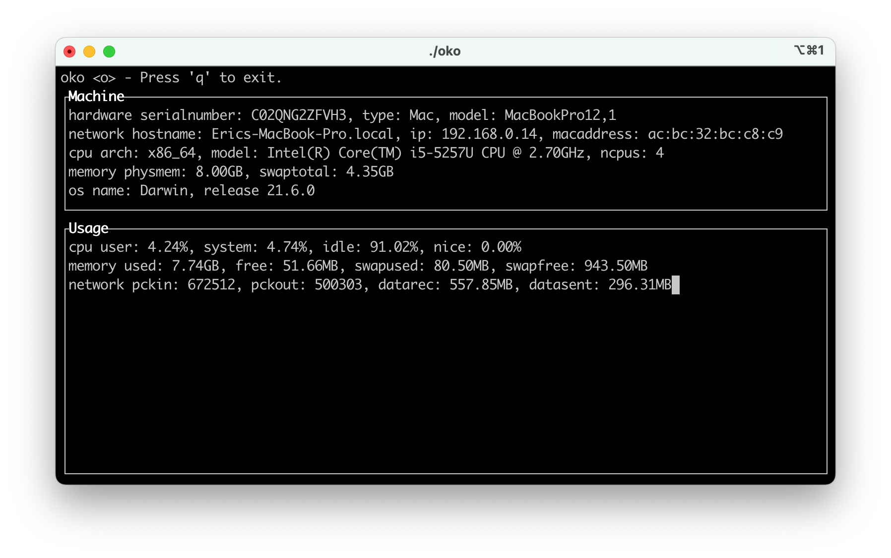
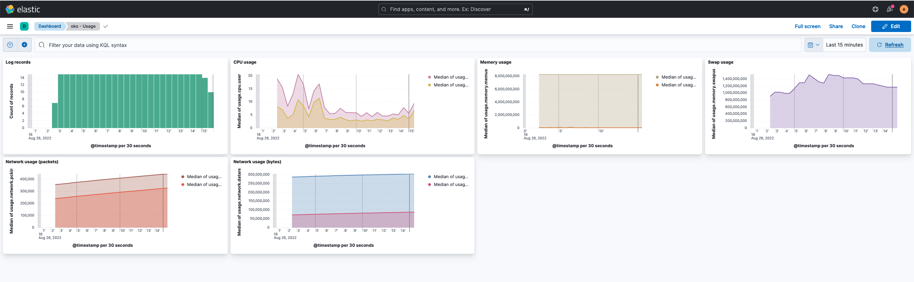

# oko-client
Agent collecting information about the OS on which it is installed.

## Supported OSes
* macOS
  - Monterey (12)
  - Big Sur (11)

## Libraries & framworks
* [cJSON](https://github.com/DaveGamble/cJSON)
* [check](https://libcheck.github.io/check/)

## Collected data

### Machine data
* Hardware info
  - Serial number
  - Type
  - model
* Network info
  - Hostname
  - IP address (only IPv4)
  - MAC address
* CPU info
  - Architecture
  - Model
  - Number of CPUs
* Memory info
  - Physical memory
  - Swap
* OS info
  - Name
  - Release

### Usage data
* CPU
* Memory
* Swap
* Network

## Usage
`oko` supports two mode, one interactive (like `top`) and one that logs information into JSON format.
```
Usage: oko [options]
Options:
    -h               Print this message and exit.
    -i [interval]    Sets refresh interval (in seconds).
    -l               Log the output instead of displaying it on the terminal.
```

### Screenshots

#### Standalone mode


#### Logging mode
This example shows custom Kibana dashboards.

